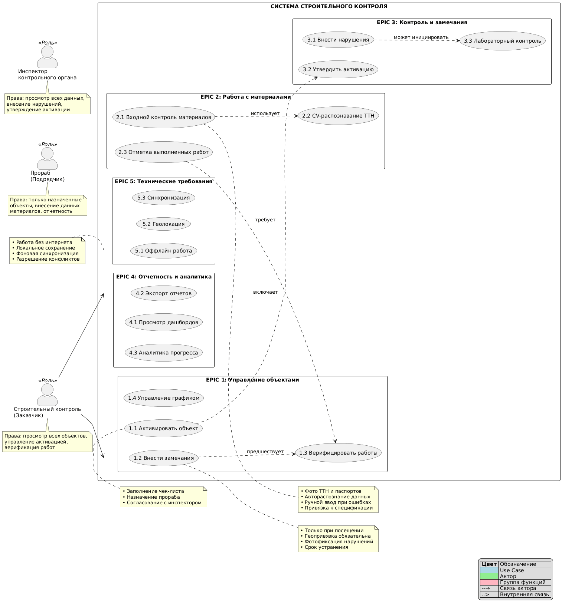

# inginer
введтся работа над проектом
MIRO
https://miro.com/app/board/uXjVJFwdTbE=/

# **Система управления дефектами в строительных проектах**
## **Назначение системы**
Система предназначена для централизованного контроля дефектов на строительных объектах. Она охватывает весь процесс работы с дефектами: от их обнаружения и фиксации до назначения ответственных, исправления и формирования отчетности. Это позволяет повысить прозрачность процессов, снизить риски и обеспечить своевременное устранение проблем.
## **Основные пользователи и их роли**
- Инженеры: регистрируют дефекты, вносят изменения, добавляют комментарии и материалы.
- Менеджеры: распределяют задачи между исполнителями, контролируют сроки и статусы работ, формируют отчеты.
- Руководители и заказчики: отслеживают общий прогресс, анализируют статистику и принимают управленческие решения на основе данных.
## **Ключевые цели**
- Автоматизация процессов регистрации и контроля дефектов.
- Обеспечение прозрачности выполнения задач для всех участников.
- Своевременное выявление и устранение критических дефектов.
- Предоставление удобного интерфейса с разграничением прав доступа.
- Формирование аналитической отчетности для руководства.
## **Особенности системы**
- Учет различных типов дефектов (локальные, критичные и т.д.).
- Возможность прикрепления файлов (фото, документы).
- Поддержка полного жизненного цикла дефекта: от создания до закрытия.
- Безопасное хранение данных и защита от внешних угроз.

\_\_\_\_\_\_\_\_\_\_\_\_\_\_\_\_\_\_\_\_\_\_\_\_\_\_\_\_\_\_\_\_\_\_\_\_\_\_\_\_
## **Функциональные возможности**
1. Регистрация и аутентификация
- Регистрация пользователей с проверкой данных.
- Вход через логин и пароль с защитой данных.
- Восстановление пароля по email.
1. Управление доступом
- Разделение ролей: инженер, менеджер, руководитель, наблюдатель.
- Ограничение прав в зависимости от роли.
1. Управление проектами
- Создание и редактирование проектов.
- Добавление этапов с описанием и сроками.
1. Работа с дефектами
- Создание дефектов с указанием заголовка, описания, приоритета, исполнителя и сроков.
- Прикрепление фотографий и документов.
- Изменение статусов (Новая, В работе, На проверке, Закрыта, Отменена).
- Уведомления ответственных при изменении статуса.
- История изменений с возможностью отката.
1. Коммуникация
- Добавление комментариев к дефектам.
- Уведомления участников о новых комментариях.
1. Поиск и фильтрация
- Поиск дефектов по различным параметрам (название, статус, исполнитель и т.д.).
- Фильтрация по проектам, приоритетам и датам.
1. Отчетность и аналитика
- Формирование отчетов по дефектам, проектам и исполнителям.
- Визуализация данных в виде графиков и диаграмм.
- Экспорт отчетов в CSV и Excel.
1. Безопасность
- Защита паролей с использованием современных методов шифрования.
- Защита от SQL-инъекций, XSS и CSRF-атак.
- Регулярное резервное копирование данных.
1. Интерфейс
- Поддержка русского языка.
- Адаптивный дизайн для ПК и планшетов.
- Совместимость с современными браузерами (Chrome, Firefox, Edge).
- \_\_\_\_\_\_\_\_\_\_\_\_\_\_\_\_\_\_\_\_\_\_\_\_\_\_\_\_\_\_\_\_\_\_\_\_\_\_\_\_
## **Пользовательские сценарии**
- Регистрация и вход

  Пользователь регистрируется в системе или входит под своим логином и паролем, чтобы получить доступ к функционалу.

- Создание дефекта

  Инженер фиксирует дефект, заполняет обязательные поля и прикрепляет фото.

- Назначение исполнителя

  Менеджер выбирает ответственного за исправление дефекта из списка инженеров.

- Изменение статуса

  Инженер обновляет статус дефекта (например, переводит его в "В работе" или "Закрыто").

- Добавление комментариев

  Участники проекта общаются в рамках дефекта, оставляя комментарии и уточнения.

- Поиск и фильтрация

  Пользователь ищет дефекты по ключевым параметрам для быстрого доступа к информации.

- Формирование отчетов

  Руководитель анализирует статистику по дефектам и экспортирует данные для презентации.
## **Технические требования**
Производительность: время отклика системы не более 1 секунды при нагрузке 50 пользователей.

Безопасность: защита данных, регулярное резервное копирование.

Совместимость: работа в современных браузерах и на мобильных устройствах.

**Use Case Diagram (Диаграмма прецедентов)**

